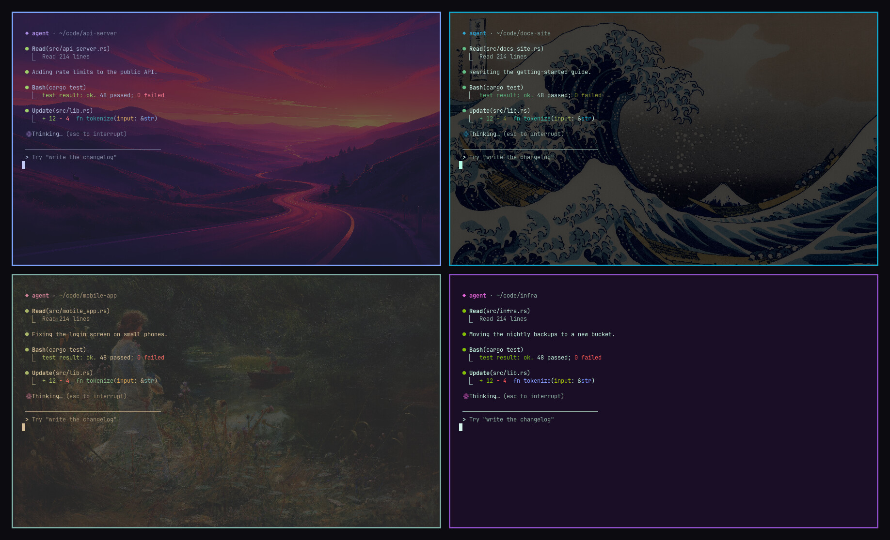

# Terminal Tint

An [Omarchy](https://omarchy.org) shell plugin for telling terminal windows apart.
Give each one its own look while whatever runs inside keeps running: a background
tint, an [Aether](https://github.com/bjarneo/aether) mood made from a wallpaper,
a whole Omarchy theme or, in Ghostty, its own wallpaper, plus a matching border.
That's handy when a handful of coding agents are going at once.

> **Wallpapers require Ghostty.** Tints, moods and themes work in foot,
> Alacritty, Kitty and Ghostty. A wallpaper behind the text is a Ghostty
> feature, so that part needs Ghostty as your terminal
> (`omarchy install terminal ghostty`) and a one-time setup from the picker.
> The plugin says so in a notification the first time it loads.



Press a key and a picker shows every terminal with a live preview. Hover a color,
mood or theme to try it on the real window, click to keep it.

## Features

- **Live previews**: every terminal appears as a live thumbnail, on any workspace.
- **See which window you're picking**: the desktop dims around the selected terminal and outlines it with its name, on whichever monitor it's on. A terminal on another workspace is marked as not on screen.
- **Try before you pick**: hovering a swatch, mood or theme changes the actual window. Move away and it goes back.
- **Aether moods**: Fire, Ocean, Forest, Neon, Sunset, Vaporwave, Midnight, Aurora and the rest of Aether's modes, generated from your current wallpaper or any wallpaper in Aether's library.
- **Themes per terminal**: give one terminal Tokyo Night and another Gruvbox. Every installed Omarchy theme is listed with its wallpaper, including themes Aether made.
- **Wallpapers per terminal (Ghostty)**: put a different wallpaper behind each Ghostty window and change it while the window runs. A mood or theme can bring its wallpaper along, and the strength (Faint, Soft, Medium, Strong) keeps text readable on light and dark pictures.
- **Nothing restarts**: looks are escape sequences sent to the window's pty, so agents, editors and shells keep running.
- **Matching borders**: the Hyprland border takes the look's accent color, bright on the focused window and dark on the others so you can still see focus move (press `B` to turn it off).
- **Text shadow (Ghostty)**: a soft drop shadow under the text so it reads cleanly over any wallpaper. A tiny GPU shader that only runs when the terminal redraws. Press `T` to toggle.
- **A default for new terminals**: new terminals can open with a saved look (and wallpaper), or each get a different tint automatically so new agents never look alike. Set it in the picker's New terminals tab.
- **Pulses when an agent is done**: when an agent finishes and waits for you, its terminal's border breathes in its own color until you click into it. Works with agents that show a spinner in the window title (like Claude Code) and with any program that rings the terminal bell. Press `P` to turn it off.
- **Fits every theme**: tints are your theme's background with a little of the hue mixed in, so text stays readable on light and dark themes. Switching themes re-derives them.
- **Scriptable**: `terminal-tint red --title api` from a shell, a keybinding or an agent.

## Requirements

- **Omarchy 4**, whose Quickshell-based shell runs the plugin.
- **Aether 4 or newer** for moods. Omarchy installs Aether by default; if it's gone, `omarchy pkg add aether`.
- **Ghostty** for wallpapers: `omarchy install terminal ghostty`, then the one-time setup below.

Tints and themes need nothing else. Terminal Tint checks for Aether and Ghostty
itself: the first-run notification and the picker's Moods and Wallpapers tabs
say what's missing and how to get it, and `terminal-tint --check` lists it all.

## Install

```bash
omarchy plugin add https://github.com/ekkostech/omarchy-terminal-tint.git --enable --yes
omarchy restart shell
```

The first time it loads, Terminal Tint shows a notification about what it does
and whether wallpapers are ready. Click it to open the picker.

For wallpapers, use Ghostty and run the setup once. The **Set up Ghostty for
wallpapers** button in the picker's Wallpapers tab does the same as this:

```bash
omarchy install terminal ghostty        # if Ghostty isn't your terminal yet
terminal-tint setup-ghostty
```

Then bind a key to open the picker. Add this to `~/.config/hypr/bindings.lua`:

```lua
o.bind("SUPER + ALT + T", "Terminal Tint", "omarchy-shell shell toggle ekkostech.terminal-tint '{}'")
```

## Using the picker

| Key | Action |
|-----|--------|
| Hover a swatch, mood or theme | Preview it on that terminal |
| Click it | Keep it |
| `1`–`8` | Tint: red, orange, amber, green, teal, blue, purple, pink |
| `0` / `Backspace` | Back to the terminal's own colors |
| `N` | Next tint |
| `Space` / `Shift+Space` | Next / previous mood, theme or wallpaper |
| `Tab` | Switch between Moods, Themes, Wallpapers and New terminals |
| `W` / `Shift+W` | Next / previous wallpaper to make moods from |
| Arrows / `hjkl` | Move between terminals |
| `D` | Save the selected terminal's look as the default for new terminals |
| `T` | Text shadow on/off (Ghostty) |
| `B` | Borders on/off |
| `P` | Pulse when an agent is done, on/off |
| `Esc` / `Enter` | Close |

The terminal you were in is selected when the picker opens. The tint dots sit on
each terminal's card; moods, themes and wallpapers apply to the selected
terminal. On a Ghostty window, **with its wallpaper** (next to the tabs) makes a
mood or theme bring its wallpaper along.

Moods need Aether 4 or newer. Without it, the Moods tab says how to get it, and
tints, themes and wallpapers still work.

## Scripting

`bin/terminal-tint` wraps the plugin's IPC. To use it, link it onto your `PATH`:

```bash
ln -s ~/.config/omarchy/plugins/ekkostech.terminal-tint/bin/terminal-tint ~/.local/bin/
```

```bash
terminal-tint                      # open the picker
terminal-tint red                  # tint the focused terminal
terminal-tint next                 # cycle the focused terminal
terminal-tint blue --title api     # every terminal whose title contains "api"
terminal-tint '#203040' --pid 1234 # any hex color, by terminal pid
terminal-tint reset --all          # clear everything
terminal-tint mood:fire --title docs
terminal-tint mood:ocean@/path/to/wallpaper.jpg
terminal-tint theme:tokyo-night --pid 1234
terminal-tint wallpaper ~/Wallpapers/forest.jpg --strength 0.15  # Ghostty
terminal-tint wallpaper none
terminal-tint --looks              # list moods, themes and wallpapers
terminal-tint --check              # what's installed and what's missing
terminal-tint borders off
terminal-tint pulse off            # or on; 'pulse now --title api' to try it
terminal-tint shadow on            # drop shadow under the text in Ghostty windows
terminal-tint default auto         # new terminals each get a different tint
terminal-tint default from         # new terminals copy the focused terminal's look
terminal-tint default none
terminal-tint --list
```

Under the hood these call
`omarchy-shell shell call ekkostech.terminal-tint apply '{"value":"red","target":"title:api"}'`.
The targets are `focused`, `title:TEXT`, `pid:N`, `address:HEX` and `all`. The
values are a hue name, `#rrggbb`, `next`, `reset`, `mood:NAME[@WALLPAPER]`,
`theme:NAME`, `wallpaper:/path/to/image.jpg` or `wallpaper:none`.

## How it works

The plugin lists Hyprland's windows and finds each terminal's pty: the
controlling tty of the window process's children. It then writes standard
escape sequences to that pty, which the terminal treats like any program output
that changes its colors:

- `OSC 11` sets the background (a tint is only this),
- `OSC 4` sets the 16 ANSI colors, `OSC 10` the text and `OSC 12` the cursor,
- `OSC 104`, `110`, `111` and `112` put them back to the terminal's configuration.

Tints mix a hue into your theme's background, and they're re-mixed when you
switch themes. Moods come from `aether --extract-palette WALLPAPER
--extract-mode MODE`. Themes map `colors.toml` onto the 16 colors the same way
Omarchy's foot template does.

Wallpapers use Ghostty's `background-image` option. Out of the box, Omarchy runs
every Ghostty window in one shared process, so a config change would hit all of
them. `terminal-tint setup-ghostty` installs a small launcher
(`~/.local/bin/terminal-tint-ghostty`) and points Ghostty's desktop entry at it.
Each new window then runs as its own process with an optional config file of
its own, `$XDG_RUNTIME_DIR/terminal-tint/ghostty/PID.conf`. Setting a
wallpaper writes that file and sends the window `SIGUSR2`, which makes Ghostty
reload it. The plugin only signals processes it has confirmed are Ghostty
windows started by the launcher. Omarchy's theme switch reloads Ghostty the same
way, so wallpapers survive it. `terminal-tint setup-ghostty --undo` reverts the
setup.

The pulse watches Hyprland's window events. A title that switches from a
spinner (`◐ ◓ ◑ ◒`) to `✳` means an agent finished, and an `urgent` event means
the window rang the bell. Either starts the pulse unless the window already has
focus. Focusing the window, or the agent starting work again, stops it. Ghostty
reports bells by default; foot only with `[bell] urgent=yes` in `foot.ini`.

Looks are recorded per pty in `$XDG_RUNTIME_DIR/terminal-tint/` so the picker
can show them. Each record is tied to the terminal's pid, so a reused pty starts
clean. The border setting is saved in `~/.config/omarchy/terminal-tint.json`.

## Compatibility

- **Ghostty**: tested, including wallpapers, for windows opened after `setup-ghostty`. Ghostty windows opened before it share one process and are left out.
- **foot**: tested for tints, moods and themes. No wallpapers: foot can't draw images behind text.
- **Alacritty, Kitty**: should work for tints, moods and themes, since they also run one process per window and support the same escape codes. Not tested yet.
- **foot `--server` / `footclient`**: every window shares one process, so its windows can't be told apart. They're left out of the picker.
- A program that sets its own colors (a few TUIs do) overrides the look while it runs.
- Hyprland 0.56 draws only one color for a per-window border, so borders are solid rather than gradients.
- Moods made from a wallpaper show its colors in any terminal; the picture itself only appears in Ghostty.

## Uninstall

```bash
terminal-tint reset --all
terminal-tint setup-ghostty --undo   # only if you set up wallpapers
omarchy plugin remove ekkostech.terminal-tint
```

## License

MIT
